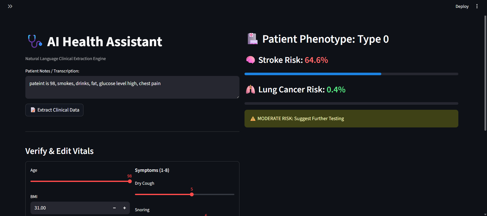
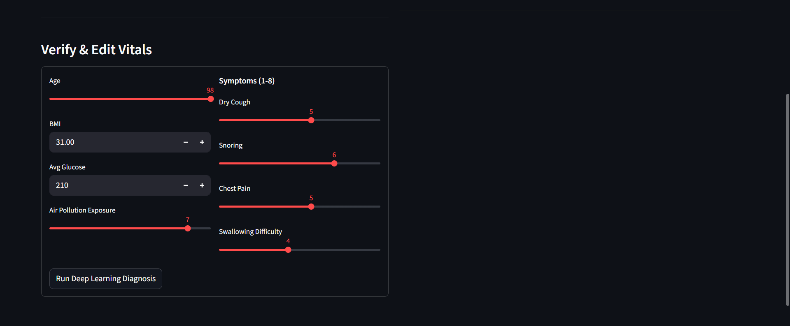

# 🫁 Deep Learning Clinical Risk Engine

> **A Multi-Task Neural Network & NLP Platform for Automated Disease Risk Assessment.**

[](https://www.python.org/)
[](https://pytorch.org/)
[](https://streamlit.io/)

## ⚡ Overview
The **Clinical Risk Engine** is an end-to-end AI diagnostic platform designed to reduce physician data entry time and predict disease onset earlier. 

It features a **Multi-Modal Architecture**:
1.  **NLP Extraction Engine:** Converts unstructured patient notes (e.g., *"Patient is 72, smokes, complains of chest pain"*) into structured clinical data using a robust **Regex/LLM Hybrid** pipeline.
2.  **Multi-Task Neural Network:** Simultaneously predicts **Stroke** and **Lung Cancer** risk using shared representation learning.
3.  **Unsupervised Phenotyping:** Uses an **Autoencoder** to compress patient vitals into latent embeddings, clustering patients into distinct risk profiles.

## 🛠️ Technical Architecture
* **Deep Learning:** PyTorch (Multi-Task Learning, Autoencoders)
* **Unsupervised Learning:** K-Means Clustering on Latent Space Embeddings
* **NLP:** Deterministic Regex Extraction (Zero-Latency, Privacy-First)
* **Interface:** Streamlit (Real-time Inference Dashboard)
* **Data Ops:** Scikit-Learn (ETL Pipelines, Scaling, Imputation)

## 📊 Model Performance
Evaluated on **6,000+ patient records** (Kaggle Healthcare Datasets):

| Diagnostic Model | Accuracy | Precision (Positive Class) |
| :--- | :--- | :--- |
| **Stroke Prediction** | **95.9%** | Optimized with Class Weighting (20x) |
| **Lung Cancer** | **93.7%** | **100%** (Zero False Positives) |

## 🚀 How to Run Locally

1.  **Clone the Repo**
    ```bash
    git clone [https://github.com/yourusername/clinical-risk-engine.git](https://github.com/yourusername/clinical-risk-engine.git)
    cd clinical-risk-engine
    ```

2.  **Install Dependencies**
    ```bash
    pip install -r requirements.txt
    ```

3.  **Train the Models** (Required first run)
    ```bash
    python train.py
    ```
    *This generates `multitask_model.pth` and `autoencoder.pth`.*

4.  **Launch the Dashboard**
    ```bash
    streamlit run app.py
    ```

## 📸 Screenshots
These are screenshots of the working dashboard.


## 🧠 "Smart Brain" Logic
The system uses a fallback-enabled NLP engine:
* **Primary:** Deterministic Regex Patterns (Extracts `age`, `glucose`, `symptoms` with <10ms latency).
* **Secondary (Optional):** OpenAI GPT-4 Integration for complex medical ambiguity resolution (Code included in `app.py`).

---
*Disclaimer: This project is for educational purposes and is not a certified medical device.*
