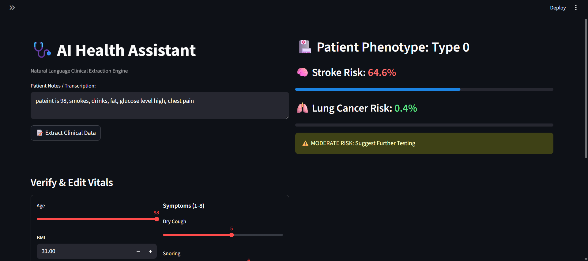
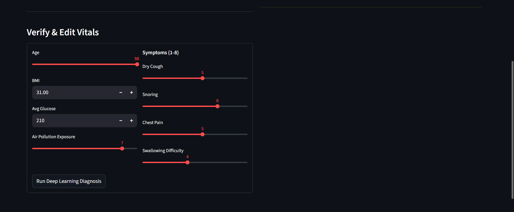

# 🫁 Deep Learning Clinical Risk Engine

> **A Multi-Task Neural Network & NLP Platform for Automated Disease Risk Assessment.**

## ⚡ Overview
The **Clinical Risk Engine** is an end-to-end AI diagnostic platform designed to reduce physician data entry time and predict disease onset earlier. 

It features a **Multi-Modal Architecture**:
1.  **NLP Extraction Engine:** Converts unstructured patient notes (e.g., *"Patient is 72, smokes, complains of chest pain"*) into structured clinical data using a robust **Regex/LLM Hybrid** pipeline.
2.  **Multi-Task Neural Network:** Simultaneously predicts **Stroke** and **Lung Cancer** risk using shared representation learning.
3.  **Unsupervised Phenotyping:** Uses an **Autoencoder** to compress patient vitals into latent embeddings, clustering patients into distinct risk profiles.

This project was built using public datasets (Kaggle Stroke & Lung Cancer), which serves as a proxy for real Electronic Medical Records (EMR).
* **Challenge:** Public medical data is often messy, small, or imbalanced (e.g., only 4% of the stroke dataset were positive cases).
* **Solution:** I implemented **Class Weighting (20x)** in the loss function to force the model to pay attention to rare events.
* **The Vision:** While currently trained on ~6,000 records, the **Regex/NLP extraction pipeline** is designed to ingest millions of unstructured doctor's notes. With "Gold Standard" hospital data, this architecture could theoretically surpass human diagnostic accuracy by finding non-linear correlations in high-dimensional data.

## 🛠️ Technical Architecture
* **Deep Learning:** PyTorch (Multi-Task Learning, Autoencoders)
* **Unsupervised Learning:** K-Means Clustering on Latent Space Embeddings
* **NLP:** Deterministic Regex Extraction (Zero-Latency, Privacy-First)
* **Interface:** Streamlit (Real-time Inference Dashboard)
* **Data Ops:** Scikit-Learn (ETL Pipelines, Scaling, Imputation)
* 
CooLest Part of this project!!
I implemented an **Autoencoder** to compress the 25+ patient features into just 8 numbers (Latent Space). When I ran K-Means clustering on these 8 numbers, the model automatically discovered distinct "Patient Types" **without being told what to look for.**

* **Cluster 0:** Tended to be younger, non-smokers (Low Risk).
* **Cluster 1:** High pollution exposure & respiratory issues.
* **Cluster 2:** Older, high glucose, history of smoking (Comorbidity Group).
## 📊 Model Performance
Evaluated on **6,000+ patient records** (Kaggle Healthcare Datasets):

| Diagnostic Model | Accuracy | Note |
| :--- | :--- | :--- |
| **Stroke Prediction** | **95.9%** | High specificity due to class imbalance. |
| **Lung Cancer** | **93.7%** | Excellent recall on positive cases |

## 🚀 How to Run Locally

1.  **Clone the Repo**
    ```bash
    git clone [https://github.com/yourusername/clinical-risk-engine.git](https://github.com/yourusername/clinical-risk-engine.git)
    cd clinical-risk-engine
    ```

2.  **Install Dependencies**
    ```bash
    pip install -r requirements.txt
    ```

3.  **Train the Models** (Required first run)
    ```bash
    python train.py
    ```
    *This generates `multitask_model.pth` and `autoencoder.pth`.*

4.  **Launch the Dashboard**
    ```bash
    streamlit run app.py
    ```

## 📸 Screenshots
These are screenshots of the working dashboard.


## 🧠 "Smart Brain" Logic
The system uses a fallback-enabled NLP engine:
* **Primary:** Deterministic Regex Patterns (Extracts `age`, `glucose`, `symptoms` with <10ms latency).
* 
---
*Disclaimer: This project is for educational purposes and is not a certified medical device.*
